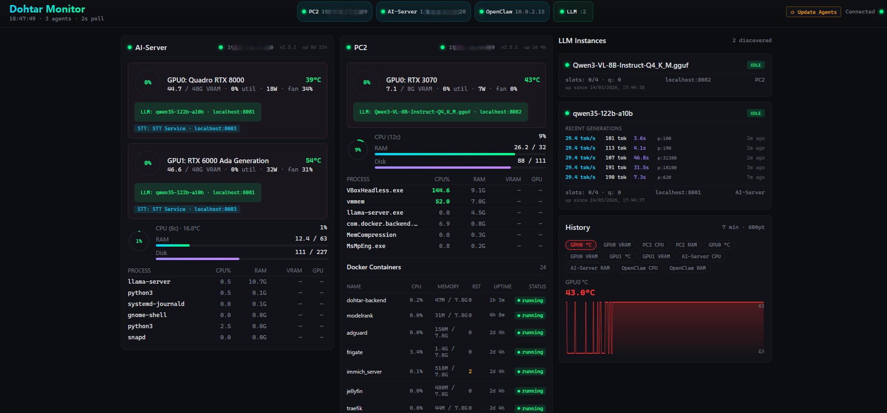

# Dohtar Monitor

[](https://opensource.org/licenses/MIT)
[](https://www.python.org/)
[](https://nodejs.org/)
[](https://www.docker.com/)

Help me buy Claude Pro Max: bc1q24qhjfhyudqkldn5lc9vemgpfv9hesanvcw70d

A self-hosted homelab monitoring system for tracking GPU metrics, system resources, Docker containers, and LLM instances across multiple machines in real-time.



## Features

- **GPU Monitoring**: VRAM usage, temperature, utilization, power draw, and fan speed via nvidia-smi or pynvml
- **System Metrics**: CPU, RAM, disk usage, and uptime across all monitored machines
- **Per-Process Tracking**: Detailed GPU memory mapping at the process level
- **Docker Support**: Real-time container health monitoring with CPU %, memory, restart counts, and status
- **LLM Instance Monitoring**: Track llama.cpp and Ollama instances with idle/generating status, live token/s throughput, KV cache usage, and slot tracking
- **Generation History**: Detailed per-request metrics including exact token/s speed, token counts, and duration
- **Over-The-Air Updates**: Agents auto-update from the dashboard
- **Multi-Machine Support**: Monitor unlimited machines with unique IDs and real-time WebSocket synchronization
- **Interactive Installer**: Guided CLI installer with auto-discovery of backend and local LLM/STT services
- **Zero Build Step Dashboard**: Single-file React SPA with in-browser Babel compilation — no build process needed

## Table of Contents

- [Quick Start](#quick-start)
- [Architecture](#architecture)
- [Installation](#installation)
  - [Backend Setup](#backend-setup)
  - [Agent Setup](#agent-setup)
- [Configuration](#configuration)
  - [Agent Config Reference](#agent-config-reference)
- [LLM Monitoring](#llm-monitoring)
- [API Endpoints](#api-endpoints)
- [Dashboard](#dashboard)
- [Troubleshooting](#troubleshooting)
- [Contributing](#contributing)
- [License](#license)

## Quick Start

### Backend (Docker)
```bash
docker compose up -d
```
Backend will be available at `http://localhost:9090`

### Agent (on any machine in your network)

Once the backend is running, set up an agent on each machine you want to monitor:

**Linux:**
```bash
curl http://<backend-ip>:9090/api/download-agent -o agent.zip
unzip agent.zip -d ocm-agent && cd ocm-agent
pip install -r requirements.txt
python3 install.py
```

**Windows (PowerShell):**
```powershell
Invoke-WebRequest http://<backend-ip>:9090/api/download-agent -OutFile agent.zip
Expand-Archive agent.zip -DestinationPath ocm-agent; cd ocm-agent
pip install -r requirements.txt
python install.py
```

The installer auto-discovers the backend on your LAN, scans for running LLM/STT services, and configures everything interactively.

## Architecture

Dohtar Monitor follows a distributed agent-based architecture with a centralized backend:

```
┌─────────────────────────────────────────────────────────────┐
│                    Dashboard (React SPA)                     │
│              Single HTML file, Babel in-browser              │
│         Real-time updates via WebSocket connection           │
└──────────────────────┬──────────────────────────────────────┘
                       │ HTTP/WebSocket (:9090)
┌──────────────────────▼──────────────────────────────────────┐
│              Backend (Express.js + SQLite)                   │
│                                                              │
│  • API endpoints for metric ingestion and querying          │
│  • WebSocket server for real-time dashboard updates        │
│  • OTA update queue management                             │
│  • Metrics storage (SQLite with better-sqlite3)            │
│  • UDP discovery listener (:9091)                          │
└──────────────────────┬──────────────────────────────────────┘
                       │ REST API (POST /api/ingest)
        ┌──────────────┼──────────────┐
        │              │              │
┌───────▼──────┐ ┌────▼──────┐ ┌────▼──────┐
│  Agent 1     │ │  Agent 2  │ │  Agent N  │
│  (Linux)     │ │  (Windows)│ │  (Linux)  │
│              │ │           │ │           │
│ • Metrics    │ │ • Metrics │ │ • Metrics │
│   collection │ │   collect │ │   collect │
│ • GPU stats  │ │ • GPU     │ │ • GPU     │
│ • Docker mon │ │   stats   │ │   stats   │
│ • LLM track  │ │ • Docker  │ │ • LLM     │
└──────────────┘ │   mon     │ │   track   │
                 │ • LLM     │ │           │
                 │   track   │ └───────────┘
                 └───────────┘

Every 2 seconds: Agent → Backend (metrics POST)
Continuous: Backend → Dashboard (WebSocket push)
```

## Installation

### Backend Setup

#### Prerequisites
- Node.js 18 or higher
- Docker and Docker Compose (recommended) or local SQLite3

#### Using Docker (Recommended)

1. Clone the repository:
```bash
git clone https://github.com/Dohtar1337/dohtar-monitor.git
cd dohtar-monitor
```

2. Build and run:
```bash
docker compose up -d
```

The included `docker-compose.yml` exposes port 9090 (HTTP/WebSocket/API) and port 9091/udp (agent auto-discovery).

3. Verify the backend is running:
```bash
curl http://localhost:9090/
```

#### Manual Setup (Linux/macOS/Windows)

1. Install dependencies (from the `backend/` directory):
```bash
cd backend
npm install
```

2. Start the backend:
```bash
npm start
```

The backend will listen on port 9090 by default.

### Agent Setup

No need to clone the repo on agent machines — the backend serves the agent files directly.

#### Prerequisites
- Python 3.10 or higher
- pip package manager

#### Download and Install

**Linux:**
```bash
curl http://<backend-ip>:9090/api/download-agent -o agent.zip
unzip agent.zip -d ocm-agent && cd ocm-agent
pip install -r requirements.txt
```

**Windows (PowerShell):**
```powershell
Invoke-WebRequest http://<backend-ip>:9090/api/download-agent -OutFile agent.zip
Expand-Archive agent.zip -DestinationPath ocm-agent; cd ocm-agent
pip install -r requirements.txt
```

> **Note**: On newer Linux distributions (Debian 12+, Ubuntu 23.04+), you may need to add `--break-system-packages` to the pip command, or use a virtual environment.

Or just open `http://<backend-ip>:9090/api/download-agent` in your browser to download the zip file.

#### Interactive Installer (Recommended)

```bash
python install.py
```

The installer will walk you through:
- Finding or entering your backend URL (auto-discovers via UDP broadcast)
- Setting a machine name and agent ID
- Choosing an install location
- Selecting which metrics to collect (system, GPU, processes, disk, Docker)
- Auto-scanning for local LLM/STT services on well-known ports
- Setting the polling interval
- Optionally installing a system service (systemd on Linux, Task Scheduler on Windows, launchd on macOS)

To reconfigure an existing installation: `python install.py configure`

To uninstall: `python install.py uninstall`

#### Manual Setup

If you prefer to configure manually instead of using the installer:

```bash
cp config.example.json config.json
# Edit config.json with your settings (see Configuration section below)
python agent.py --config config.json
```

Add `--debug` for verbose logging output.

#### Running as a Systemd Service (Linux)

The installer can do this automatically, but if you prefer manual setup:

1. Create a systemd unit file at `/etc/systemd/system/ocm-agent.service`:
```ini
[Unit]
Description=Dohtar Monitor Agent
After=network-online.target
Wants=network-online.target

[Service]
Type=simple
User=root
WorkingDirectory=/opt/ocm-agent
ExecStart=/usr/bin/python3 /opt/ocm-agent/agent.py --config /opt/ocm-agent/config.json
Restart=always
RestartSec=5

[Install]
WantedBy=multi-user.target
```

2. Enable and start:
```bash
sudo systemctl daemon-reload
sudo systemctl enable ocm-agent
sudo systemctl start ocm-agent
```

3. Check status:
```bash
sudo systemctl status ocm-agent
sudo journalctl -u ocm-agent -f
```

## Configuration

### Agent Config Reference

Create a `config.json` file in the agent directory. The easiest way is to copy and edit `config.example.json`.

| Key | Type | Required | Example | Description |
|-----|------|----------|---------|-------------|
| `agent_id` | string | Yes | `"ocm-7a3f2b1e9c04"` | Unique identifier for this agent. Auto-generated by the installer. |
| `machine_name` | string | Yes | `"GPU Workstation"` | Human-readable display name shown in the dashboard. |
| `backend_url` | string | Yes | `"http://192.168.1.100:9090"` | Full URL to the Dohtar backend. Include protocol and port. |
| `install_path` | string | No | `"/opt/ocm-agent"` | Directory where the agent is installed. Used by the updater. |
| `poll_interval` | integer | No (default: 2) | `2` | Seconds between metric collection and submission to backend. |
| `collectors` | object | No | `{ ... }` | Which metric collectors to enable. See below. |
| `services` | array | No | `[ { ... } ]` | Array of LLM/STT services to monitor. See LLM Monitoring section. |

#### Collectors Object

| Key | Type | Default | Description |
|-----|------|---------|-------------|
| `system` | boolean | `true` | CPU, RAM, uptime metrics |
| `gpu` | boolean | `true` | GPU metrics via nvidia-smi/pynvml (auto-detects all GPUs) |
| `processes` | boolean | `true` | Top processes and per-process GPU usage |
| `disk` | boolean | `true` | Disk usage metrics |
| `docker` | boolean | `false` | Docker container stats (requires Docker access) |

### Example Config

```json
{
  "agent_id": "ocm-7a3f2b1e9c04",
  "machine_name": "Main Inference Box",
  "backend_url": "http://192.168.1.50:9090",
  "install_path": "/opt/ocm-agent",
  "poll_interval": 2,
  "collectors": {
    "system": true,
    "gpu": true,
    "processes": true,
    "disk": true,
    "docker": false
  },
  "services": [
    {
      "type": "llm",
      "name": "llama.cpp",
      "endpoint": "localhost:8081",
      "probe": "llamacpp"
    },
    {
      "type": "llm",
      "name": "Ollama",
      "endpoint": "localhost:11434",
      "probe": "ollama"
    }
  ]
}
```

> **Important**: The `endpoint` field should be `host:port` without the `http://` prefix — the agent adds it automatically.

## LLM Monitoring

Dohtar Monitor tracks llama.cpp and Ollama instances in real-time, providing visibility into inference workloads, KV cache usage, and throughput metrics.

### Setup Requirements

To enable full LLM monitoring with generation history, start your llama.cpp instance with the `--metrics` and `--slots` flags:

```bash
llama-server -m model.gguf --metrics --slots -ngl 35 -c 2048
```

**Important flags:**
- `--metrics`: Enables the Prometheus metrics endpoint (required for live speed display and generation history)
- `--slots`: Enables KV cache slot tracking (required for accurate cache monitoring)

### Monitored Metrics

The dashboard displays:

- **Status**: Current state (idle, generating, or error)
- **Live Token/s**: Real-time inference speed during generation
- **KV Cache**: Current usage and total capacity
- **Slot Count**: Number of concurrent generation slots and their usage
- **Generations History**: Table with per-request metrics including token count, tokens/second speed, duration, and timestamp

### Configuration

In your `config.json`, add each llama.cpp instance under the `services` array:

```json
"services": [
  {
    "type": "llm",
    "name": "My LLM",
    "endpoint": "localhost:8081",
    "probe": "llamacpp"
  }
]
```

- `name`: Display name in the dashboard
- `endpoint`: Host and port without protocol (e.g., `localhost:8081`)
- `type`: `"llm"` for language models, `"stt"` for speech-to-text
- `probe`: `"llamacpp"` for llama.cpp, `"ollama"` for Ollama, `"whisper"` for Whisper STT

## API Endpoints

### Metrics Ingestion
**POST `/api/ingest`**

Agents send metrics to this endpoint every poll interval (default 2 seconds).

Request body:
```json
{
  "agent_id": "ocm-7a3f2b1e9c04",
  "machine_name": "GPU Workstation",
  "agent_version": "2.5.2",
  "ts": 1710432000000,
  "client_ip": "192.168.1.50",
  "system": { ... },
  "gpus": [ ... ],
  "processes": [ ... ],
  "containers": [ ... ],
  "services": [ ... ]
}
```

Response includes any pending commands (e.g., OTA update triggers).

### Latest Metrics
**GET `/api/latest`**

Retrieve the latest metrics snapshot for all agents (also broadcast via WebSocket).

### LLM Generation History
**GET `/api/history/llm/:endpoint/runs`**

Retrieve recent generation runs for a specific LLM endpoint.

Parameters:
- `:endpoint`: URL-encoded endpoint (e.g., `localhost%3A8081`)
- `?limit=100` (optional): Number of recent runs to return

Response:
```json
[
  {
    "ts": 1710432000000,
    "endpoint": "localhost:8081",
    "model": "model-name",
    "tok_generated": 256,
    "tok_prompt": 45,
    "speed_gen": 31.2,
    "speed_pp": 120.5,
    "t_generation_ms": 8205.1,
    "t_prompt_ms": 373.4,
    "t_total_ms": 8578.5
  }
]
```

### Queue Agent Update
**POST `/api/agent-update`**

Queue an OTA update for a specific agent. The update command is delivered in the next ingest response.

Request body:
```json
{
  "agent_id": "ocm-7a3f2b1e9c04"
}
```

### Download Agent Package
**GET `/api/download-agent`**

Download the agent zip file for manual installation or OTA updates.

### Agent Version
**GET `/api/agent-version`**

Returns the latest agent version available on the backend.

## Dashboard

The Dohtar Monitor dashboard is a single-file React application served by the backend. No build process is required — Babel compiles JSX in the browser.

### Features

- **Real-time Updates**: WebSocket connection delivers metrics instantly as they arrive from agents
- **Multi-Machine View**: All agents displayed in a unified interface with individual machine tabs
- **GPU Metrics**: Live VRAM, temperature, utilization, power draw, and per-process breakdowns
- **System Overview**: CPU, RAM, disk, and uptime at a glance
- **Container Monitoring**: Docker container health and resource usage
- **LLM Insights**: Real-time inference speed, KV cache usage, and generation history
- **Agent Management**: Trigger OTA updates from the dashboard

### Accessing the Dashboard

Open your browser and navigate to:
```
http://<backend-ip>:9090
```

## Troubleshooting

### Agent Cannot Connect to Backend

**Symptom**: Agent logs show connection errors or timeouts.

**Solutions**:
1. Verify the `backend_url` in `config.json` is correct and reachable:
   ```bash
   curl http://<backend-ip>:9090/api/latest
   ```
2. Check firewall rules allow outbound connections to port 9090
3. Ensure the backend is running:
   ```bash
   docker ps  # if using Docker
   ```
4. Try using the backend machine's IP instead of localhost

### GPU Metrics Not Appearing

**Symptom**: CPU and RAM show, but GPU metrics are missing.

**Solutions**:
1. Ensure `gpu` is enabled in the `collectors` section of `config.json`
2. Ensure `nvidia-smi` is available on the system (the agent uses it for GPU detection)
3. If using WSL2, verify GPU passthrough is configured correctly
4. Check agent logs for GPU initialization errors (run with `--debug` flag)

### LLM Monitoring Not Working

**Symptom**: LLM services show as offline or unreachable.

**Solutions**:
1. Verify llama.cpp is started with `--metrics` and `--slots` flags
2. Test the health endpoint manually:
   ```bash
   curl http://localhost:8081/health
   ```
3. Check the `endpoint` in `config.json` is `host:port` format without `http://` prefix
4. Ensure the endpoint is reachable from the agent machine (not just localhost)
5. Check agent logs for HTTP errors when connecting to the endpoint

### Docker Container Monitoring Missing

**Symptom**: No Docker containers appear in the dashboard.

**Solutions**:
1. Ensure `docker` is set to `true` in the `collectors` section of `config.json` (it defaults to `false`)
2. Verify Docker is installed and running
3. Check that the agent process has permission to access the Docker socket (Linux):
   ```bash
   sudo usermod -aG docker $USER
   # Then log out and back in
   ```
4. On Windows, ensure Docker Desktop is running

### WebSocket Connection Drops

**Symptom**: Real-time updates stop, dashboard becomes stale.

**Solutions**:
1. Check network connectivity between client and backend
2. Verify firewall rules allow WebSocket connections (port 9090)
3. Restart the backend service
4. Check backend logs for connection errors

### High CPU Usage by Agent

**Symptom**: The Python agent process consumes significant CPU.

**Solutions**:
1. Increase the `poll_interval` in `config.json` (default is 2 seconds)
2. Disable collectors you don't need in the `collectors` section
3. Remove unused services from the `services` array
4. Check if GPU metrics collection is stalling (verify `nvidia-smi` performance)

## Contributing

Contributions are welcome! Please feel free to open issues for bugs, feature requests, or documentation improvements.

### Development Setup

1. Clone the repository
2. Install backend dependencies: `cd backend && npm install`
3. Install agent dependencies: `cd agent && pip install -r requirements.txt`
4. Start the backend locally and agents on test machines
5. Make your changes and test thoroughly
6. Submit a pull request with a clear description of your changes

## License

Dohtar Monitor is licensed under the MIT License. See the LICENSE file for details.

---

**Current Agent Version**: 2.5.2

For support, issues, or questions, please open an issue on the GitHub repository.
